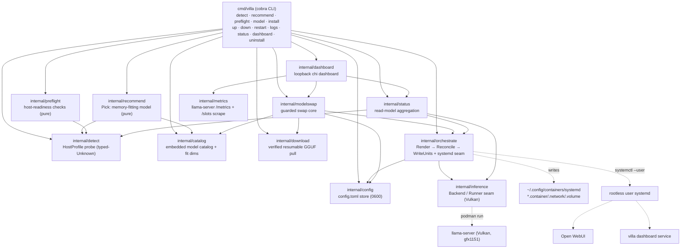

<!-- generated-by: gsd-doc-writer -->
# Architecture

## System overview

VillaStraylight is a single static Go CLI — `villa` (`cmd/villa`) — that acts as the
**control plane** for a strictly-local AI stack on an AMD Strix Halo (gfx1151) /
Fedora host. It detects the host hardware, recommends a memory-fitting
model/quant/context from a versioned catalog, gates installs behind a host-readiness
preflight, renders rootless **Podman Quadlet** units from a single config source of
truth, and orchestrates two integrated OSS containers — **llama.cpp `llama-server`**
(Vulkan inference, OpenAI-compatible) and **Open WebUI** (chat) — plus a native,
loopback-only Go **control dashboard**. The Go code is the orchestrator only; the AI
services are integrated upstream images, never rebuilt. The architectural style is a
**layered pipeline of pure cores behind injectable host seams**: every package that
makes a decision (`detect`, `recommend`, `preflight`, `orchestrate.Render`,
`orchestrate.Reconcile`, `status`, `modelswap`) is a pure, table-testable library that
returns a typed value; all host-touching effects (sysfs reads, `podman`, `systemctl`,
HTTP probes, downloads, file writes) are injected as function seams or confined to a
small number of clearly-marked impure files. The command layer (`cmd/villa`) is the
only place that prints, maps verdicts to exit codes, and calls `os.Exit`.

A defining cross-cutting contract is **typed-Unknown**: every detected signal is a
`detect.Bytes`/`detect.Bool`/`detect.Int`/`detect.Str` carrying a `Known` flag and
provenance, so "could not measure" is always distinct from a legitimate zero. This
propagates into the PASS / WARN / FAIL verdict vocabulary shared by `preflight`,
`inference`, and `status` — an unevaluable check degrades to WARN rather than a false
pass or a false hard-block.

## Component diagram



Note on the GPU backend seam: the only files permitted to hold imperative backend
literals (the container image digest, `/dev/dri` device passthrough, `--group-add
keep-groups`, the loopback publish, and the mandatory `llama-server` flags) are
`internal/inference/backend_vulkan.go` and the AMD detection seam
`internal/detect/gpu_amd.go`. A grep gate (`internal/inference/seam_test.go`,
`TestSeamGrepGate`) asserts those tokens appear nowhere else, so a future ROCm or
Metal backend slots in as a sibling `Backend` implementation without touching callers.

## Data flow

The canonical flow is the `villa install` lifecycle (`cmd/villa/install.go`,
`runInstall`), which composes the pure cores in order:

1. **Detect** — `detect.Probe()` reads `/proc/meminfo`, `/sys/class/drm`,
   `/sys/module/ttm/parameters/pages_limit`, `/proc/sys/kernel/osrelease`, and the AMD
   GPU seam to assemble a `detect.HostProfile` (CPU/arch, iGPU name + gfx id, Vulkan
   ICD, DRI nodes, ROCm presence, total RAM, and the usable GTT/unified-memory
   envelope). It never errors and never panics — every field degrades to a typed
   Unknown.
2. **Recommend** — `recommend.Pick(profile, catalog, overrides)` (a pure function)
   chooses the largest auto-eligible model whose `weight_bytes + kv_cache@ctx +
   headroom ≤ usable_envelope`. It skips bootstrap and `unified_memory_safe:false`
   entries, defaults the backend to `vulkan`, re-validates manual overrides, and
   degrades to a conservative RAM-fraction floor (or refuses) when the envelope is
   Unknown. Every term of the fit inequality is surfaced on the `Recommendation`.
3. **Preflight gate** — `preflight.RunWithResources(profile, req)` runs the
   host-readiness checks against the concrete model's `weights + KV + headroom`
   requirement: Vulkan iGPU present, podman rootless ready, user lingering, SELinux
   container-device boolean, free disk/memory floors, kernel and firmware baselines.
   Each check is BLOCK- or WARN-tier; a BLOCK-tier check that cannot be evaluated
   downgrades to WARN. BLOCK gaps are offered as **per-step consented privileged
   host-prep** (`setsebool`, `loginctl enable-linger`) — never run silently —
   overridable with `--force`.
4. **Ensure model + persist config** — the recommended GGUF is auto-pulled if absent
   via `internal/download` (HEAD-verify → resumable `.part` → per-shard SHA256 →
   atomic rename), then the chosen `model/quant/ctx/backend` plus the
   dashboard/chat defaults are written to `config.toml` via the 0600 traversal-guarded
   `config.SaveVilla` — **before** any unit work, so config is the single source of
   truth.
5. **Render** — `orchestrate.Render(RenderInput)` (pure) builds five Quadlet units —
   the inference `.container`, `villa.network`, `villa-models.volume`, and the Open
   WebUI `.container` + `.volume`. The inference unit's imperative fields are obtained
   **through** `Backend.Image()` and `Backend.ContainerArgs(spec)` and mapped to
   Quadlet keys, never re-typed.
6. **Reconcile** — `orchestrate.Reconcile(units, unitDir)` (pure) does a sha256
   render-vs-disk diff, classifying each unit Changed or Unchanged. An empty Changed
   slice is a true no-op — the idempotency core.
7. **Write + start** — `orchestrate.WriteUnits` writes each changed unit atomically
   (sibling temp + fsync + `os.Rename`, refusing any path outside the unit dir), then
   the `orchestrate.Systemd` seam runs `systemctl --user daemon-reload`, starts
   `villa-llama.service`, then `villa-openwebui.service`. The native control-dashboard
   unit is reconciled separately into `~/.config/systemd/user`, enabled for
   boot-survival, and started.
8. **Readiness poll** — the command layer polls the loopback inference endpoint's
   `/health` (503 = still loading → keep polling; timeout → WARN, never a confident
   FAIL), then prints the inference endpoint, the chat URL, and the dashboard URL.

The day-to-day verbs (`up`/`down`/`restart`/`logs` in `cmd/villa/lifecycle.go`) reuse
the same Render→Reconcile→WriteUnits→Systemd core, so hand-editing `config.toml` and
re-running `up`/`restart` converges exactly the changed units. `villa status`
(`internal/status`) and the dashboard (`internal/dashboard`) fold the **same** status
read-model — never a fork — to report per-service active state, mapped `/health`, and
the running-server GPU-offload verdict, with a worst-wins overall PASS/WARN/FAIL.

## Key abstractions

- **`detect.HostProfile`** + the typed `Bytes`/`Bool`/`Int`/`Str` optionals
  (`internal/detect/detect.go`, `internal/detect/value.go`) — the read-only host
  description and the typed-Unknown spine that every downstream decision consumes.
- **`recommend.Pick`** (`internal/recommend/recommend.go`) — the pure
  memory-fit selector; returns a `Recommendation` exposing every term of
  `weight + KV + headroom ≤ envelope`.
- **`preflight.CheckResult` / `preflight.Run` / `RunWithResources`**
  (`internal/preflight/preflight.go`) — the reusable host-readiness gate; pure,
  returns typed BLOCK/WARN-tier PASS/WARN/FAIL results with remediation + provenance.
- **`inference.Backend`** and **`inference.Runner`** (`internal/inference/inference.go`)
  — the backend-neutral seam. `Backend` (image/args) and `Runner` (start/stop/health/
  logs) isolate every GPU/podman literal; the Vulkan RADV implementation lives in
  `backend_vulkan.go`, the podman runner in `runner_podman.go`.
- **`inference.Verdict`** + `RunningOffloadVerdict` (`internal/inference/inference.go`,
  `running_offload.go`) — the dual-assert GPU-offload result (log-scrape + sysfs GTT
  delta) that catches silent CPU fallback; the shared PASS/WARN/FAIL value the CLI and
  dashboard render.
- **`orchestrate.Render` / `Reconcile` / `WriteUnits` / `Systemd`**
  (`internal/orchestrate/render.go`, `reconcile.go`, `systemd.go`) — the pure Quadlet
  renderer, the sha256 idempotency reconciler, the atomic unit writer, and the
  fixed-arg `systemctl`/`loginctl`/`journalctl` lifecycle seam.
- **`config.VillaConfig`** + `LoadVilla`/`SaveVilla` (`internal/config/villaconfig.go`)
  — the persisted `config.toml` selection (model/quant/ctx/backend + dashboard/chat
  ports), written 0600 with a path-traversal guard; the single source of truth the
  units render from.
- **`catalog.Catalog` / `CatalogModel`** (`internal/catalog/catalog.go`) — the embedded,
  schema-versioned model catalog carrying the per-model KV-fit dimensions, the
  `unified_memory_safe` flag, and per-shard download metadata.
- **`status.Report` / `status.Run` / `status.Aggregate`** (`internal/status/status.go`)
  — the JSON-neutral read-model the CLI and dashboard share; folds per-service
  active/health/offload into a worst-wins overall verdict and records loopback posture.
- **`modelswap.Run`** (`internal/modelswap/modelswap.go`) — the guarded swap core where
  ordering is the security contract: resolve-through-catalog → fit-guard refuse →
  auto-pull → persist config → reconcile/write → restart only the inference service.
- **`dashboard.Server`** (`internal/dashboard/server.go`) — the loopback-only `chi`
  control dashboard; constructed to refuse any non-loopback bind, serves a read-only
  JSON API over the shared `status` core plus the `metrics` perf scrape, with the one
  sanctioned mutation (`POST /api/models/switch`) routed through `modelswap.Run`.

## Directory structure rationale

The repository follows the standard Go `cmd/` + `internal/` split: every package under
`internal/` is a pure or seam-injected library with no CLI behavior, and `cmd/villa`
is the only consumer that prints and exits. This keeps decision logic exhaustively
table-testable and lets the same cores back both the CLI and the dashboard.

```
cmd/
  villa/              The cobra CLI: one file per subcommand (detect, recommend,
                      preflight, model, install, up/down/restart/logs, status,
                      dashboard, uninstall) plus root.go and the live-wiring of
                      each package's injectable seams.
  villastraylight/    Legacy reference-only scaffold entry point (superseded).
internal/
  detect/             Host probe → typed-Unknown HostProfile; AMD GPU seam in gpu_amd.go.
  catalog/            Embedded, schema-versioned model catalog + KV-fit dimensions.
  recommend/          Pure memory-fit model selector (Pick) over detect + catalog.
  preflight/          Pure, reusable host-readiness gate (BLOCK/WARN-tier checks).
  download/           Verified, resumable, per-shard-checksummed GGUF downloader.
  config/             config.toml store (0600, traversal-guarded); legacy env config.go.
  inference/          Backend/Runner seam: Vulkan backend + podman runner + offload assert.
  orchestrate/        Pure Quadlet Render + sha256 Reconcile + atomic WriteUnits +
                      systemd seam; Open WebUI managed-service render path.
  modelswap/          Guarded swap core (ordering-is-the-security-contract).
  status/             Shared read-model aggregation (CLI + dashboard, never forked).
  metrics/            Bounded llama-server /metrics + /slots scrape for the perf panel.
  dashboard/          Loopback-only chi control dashboard backend + embedded UI.
  llm/, server/       Legacy reference-only scaffold (OpenAI-compatible proxy + UI).
web/                  Legacy embedded React UI (reference-only).
```

The `internal/llm`, `internal/server`, `cmd/villastraylight`, and `web/` trees are an
earlier exploratory scaffold (an embedded-UI OpenAI-compatible proxy). It is superseded
by the `villa` control plane and integrated Open WebUI; it is kept as a parts bin and
is not part of the current architecture.
